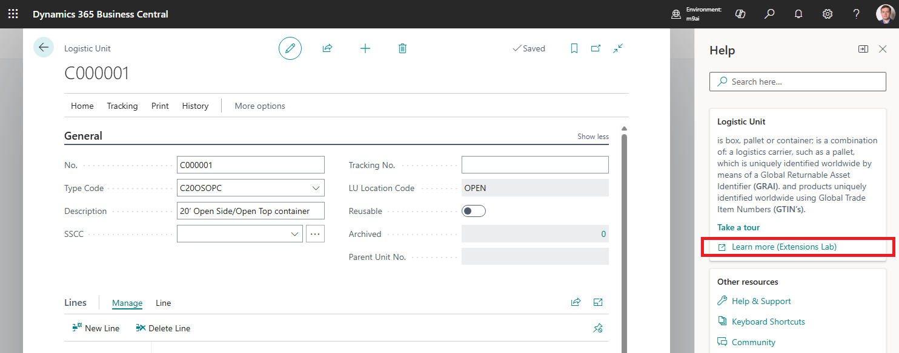
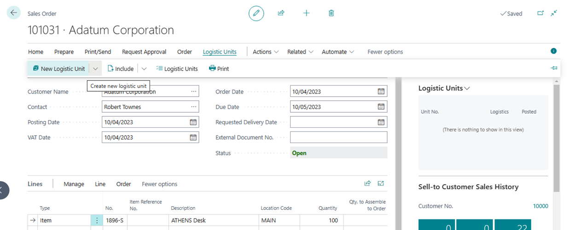
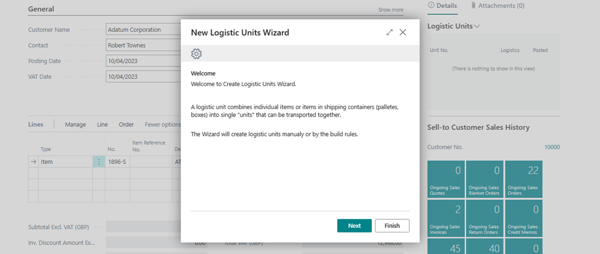
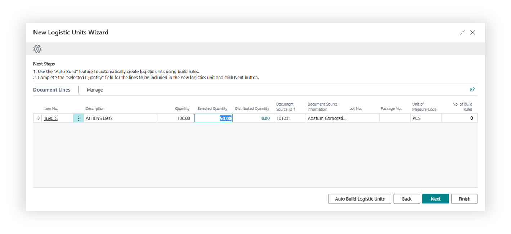
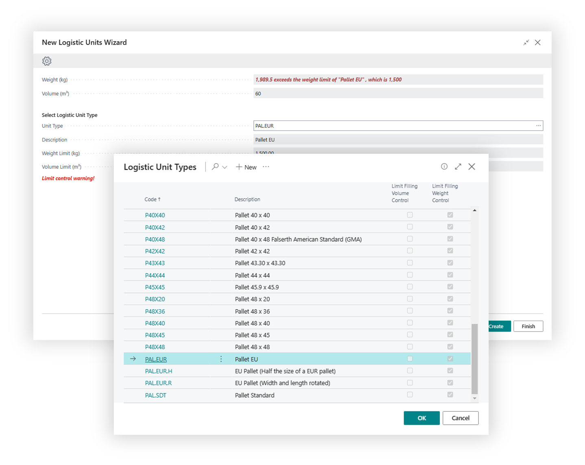
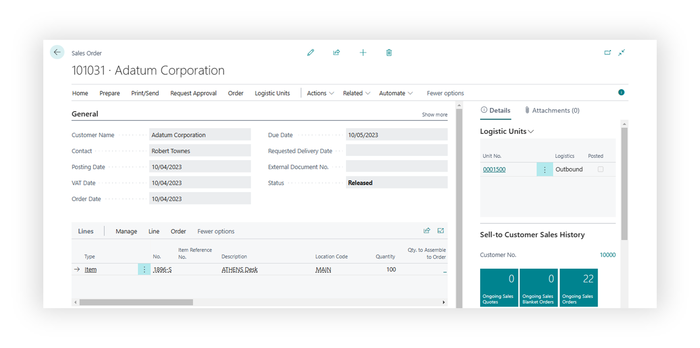
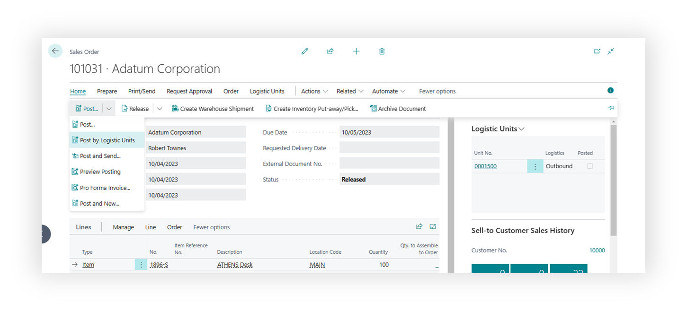
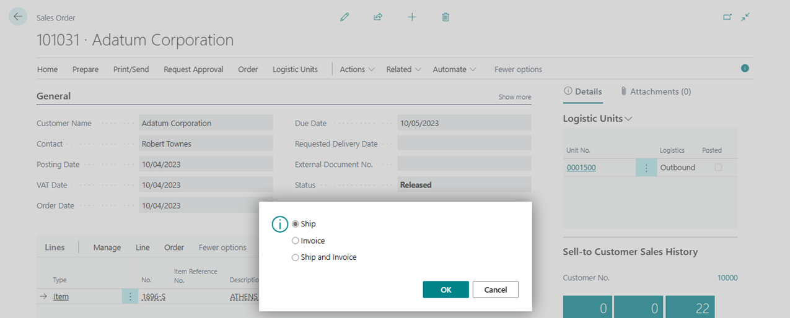

# Logistic Units Documentation

Official documentation repository for the Logistic Units extension for Microsoft Dynamics 365 Business Central

This repository contains comprehensive help documentation and guides for the [Logistic Units extension](https://appsource.microsoft.com/en-us/product/dynamics-365-business-central/PUBID.extensionsforcelimited1647259189111%7CAID.logisticunits%7CPAPPID.c383b772-f29f-4c05-b1ac-7801c76750af?tab=Overview) available on Microsoft AppSource.

## About Logistic Units

Logistic Units is a powerful extension for Microsoft Dynamics 365 Business Central that revolutionizes how you manage pallets, boxes, containers, and other logistics units within your supply chain operations.

### What is Logistic Units?

Logistic Units transforms Business Central into a comprehensive logistics management system by introducing a new entity type that represents physical containers used for transportation and storage. This extension enables you to:

- **Group items into logistics units** (pallets, boxes, containers)
- **Track logistics units** throughout the entire supply chain
- **Post documents by logistics unit** instead of individual items
- **Manage SSCC numbers** for global identification
- **Control weight and volume** during loading processes
- **Track shipments** with carrier integration

### Core Functionality

The extension provides these key capabilities:

#### Logistics Unit Management

- Create and manage different types of logistics units (pallets, containers, boxes)
- Assign unique identifiers (SSCC numbers) to each unit
- Track logistics unit types with specific parameters (size, weight limits, volume limits)

#### Document Integration

- Post sales, purchase, and warehouse documents by logistics unit
- Combine multiple orders into single containers
- Maintain inventory control at the logistics unit level
- Generate packing lists and custom labels

#### Supply Chain Tracking

- Track logistics units outside company locations
- Integrate with 1000+ carriers worldwide for shipment tracking
- Monitor logistics unit history through document trails
- Control remaining quantities by logistics unit

#### Weight & Volume Control

- Enforce weight and volume limits during loading
- Prevent overloading of logistics units
- Maintain accurate capacity management

## Opensource

Logistic Units extension is an opensource project [Logistic Units](https://github.com/Extensions-lab/logistic-units)
You can create your own solutions based on the Logistic Units extension.

## Availability

This documentation is available directly from the Logistic Units extension.

## Prerequisites

- Microsoft Dynamics 365 Business Central [product page](https://www.microsoft.com/en-us/dynamics-365/products/business-central). Logistics Units is an add-on extension for Business Central that builds on its core modules—such as Customers, Sales, Vendors, Purchasing, and Warehousing—using them as a solid foundation while adding only the features necessary for logistics.

## Key features

- Logistic unit is an entity like document or fixed asset
- Post shipment or receipt documents by logistic unit
- Combine many orders in one logistic unit (Container)
- Control location of logistic units outside company and shipment tracking by carrier
- Weight and volume control during loading process
- Control Inventory and remaining quantity by logistic unit
- History of a logistic unit by documents
- Customize SSCC labels and Packing lists
- No need to use Item Tracking setup for Items

## Terms

[Logistic Unit](logisticunit.md).

[Logistic Unit Type](logisticunittype.md).

## Operations

### Create a Logistic Unit

A logistic unit can be created in main documents of the Microsoft Dynamics 365 Business Central. Creating a logistic unit is grouping goods into a unit of a certain type.

Release Sales Document and Run New Logistic Unit Wizard. Path: Sales Order -> Logistic Units -> New Logistic Units

Expand Wizard Page to see more fields

On second page of the Wizard, you can select lines of source document and quantities that will be included in a new logistic unit.
If any line is to be skipped, set "Selected Quantity" to zero.

On the third page of the Wizard, you should select a type of the logistics unit, which determines the type of packaging and parameters such as size and some additional conditions.
If control by weight or volume toggles are activated for a selected logistic unit type, then when choosing a type, the system will warn you about possible excess.

Select: EUR Pallet and click Create

System will show the number of the logistic unit. Press Assist Button to view the created logistic unit card.
Once Wizard is closed, the system will update Logistic Units Fact box to view all logistic units that assigned to a document.

### Post by Logistic Unit

Once an item is linked to a logistic unit, posting can be done only by the logistic unit.
An attempt to post without selecting a logistic unit will return an error.

To Post order you need to select Home > Post > Post by Logistic Unit in main menu.

On the opened page, choose one or more logistic units and click "OK".

Choose the posting type and press OK.
