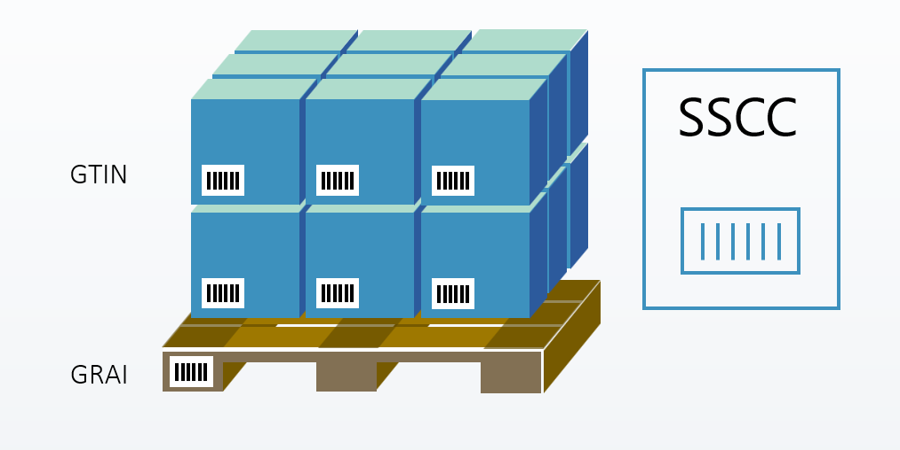

# Logistic Units for Microsoft Dynamics 365 Business Central

Help and Documentation of the [Logistic Units on AppSource](https://appsource.microsoft.com/en-us/product/dynamics-365-business-central/PUBID.extensionsforcelimited1647259189111%7CAID.logisticunits%7CPAPPID.c383b772-f29f-4c05-b1ac-7801c76750af?tab=Overview). 

## Introduction

Introducing an exciting new way to manage pallets, boxes or containers in your Business Central. With this comprehensive solution, you can effortlessly specify pallet type, and assign manual or auto-generated pallet IDs. Besides, you'll be able to assign each pallet to a lot number – making it easy to receive multiple pallets or containers.
Take your warehousing to the next level with this powerful new feature. Track your items with convenience using SSCC numbers and get better visibility of weight and volume with total quantity of shipping containers across sales, purchase, and warehouse documents.

## Opensource

Logistic Units extension is an opensource project [Logistic Units](https://github.com/Extensions-lab/logistic-units)
You can create your own solutions based on the Logistic Units extension.

## Availability

This documentation is available directly from the Logistic Units extension.

## Prerequisites

- Microsoft Dynamics 365 Business Central [product page](https://www.microsoft.com/en-us/dynamics-365/products/business-central). Logistics Units is an add-on extension for Business Central that builds on its core modules—such as Customers, Sales, Vendors, Purchasing, and Warehousing—using them as a solid foundation while adding only the features necessary for logistics.

## Key features

- Logistic unit is an entity like document or fixed asset
- Post shipment or receipt documents by logistic unit
- Combine many orders in one logistic unit (Container)
- Control location of logistic units outside company and shipment tracking by carrier
- Weight and volume control during loading process
- Control Inventory and remaining quantity by logistic unit
- History of a logistic unit by documents
- Customize SSCC labels and Packing lists
- No need to use Item Tracking setup for Items

## Terms

Logistic Unit is an item that is used for transportation or storage and needs to be managed through the supply chain. It could be a box or a pallet containing a few products, or an intermodal container with several pallets. The logistic unit includes information such as SSCC numbers, serial numbers, and total quantity of items that can be added to sales, purchase and warehouse documents.

Logistic Unit is identified by a combination of:

- a carrier, such as a pallet, which is uniquely identified worldwide by means of a Global Returnable Asset Identifier (GRAI).
- and products/items uniquely identified worldwide using Global Trade Item Numbers (GTIN’s).

SSCC - Serial Shipping Container Code can be used by companies to identify a logistic unit, which can be any set of trade items packed together for storage and/or transportation purposes; for example, a case, pallet or parcel.

## Operations

### Create a Logistic Unit

A logistic unit can be created in main documents of the Microsoft Dynamics 365 Business Central. Creating a logistic unit is grouping goods into a unit of a certain type.

Release Sales Document and Run New Logistic Unit Wizard. Path: Sales Order -> Logistic Units -> New Logistic Units

Expand Wizard Page to see more fields

On second page of the Wizard, you can select lines of source document and quantities that will be included in a new logistic unit.
If any line is to be skipped, set "Selected Quantity" to zero.

On the third page of the Wizard, you should select a type of the logistics unit, which determines the type of packaging and parameters such as size and some additional conditions.
If control by weight or volume toggles are activated for a selected logistic unit type, then when choosing a type, the system will warn you about possible excess.

Select: EUR Pallet and click Create

System will show the number of the logistic unit. Press Assist Button to view the created logistic unit card.
Once Wizard is closed, the system will update Logistic Units Fact box to view all logistic units that assigned to a document.

### Post by Logistic Unit

Once an item is linked to a logistic unit, posting can be done only by the logistic unit.
An attempt to post without selecting a logistic unit will return an error.

To Post order you need to select Home > Post > Post by Logistic Unit in main menu.

On the opened page, choose one or more logistic units and click "OK".

Choose the posting type and press OK.

