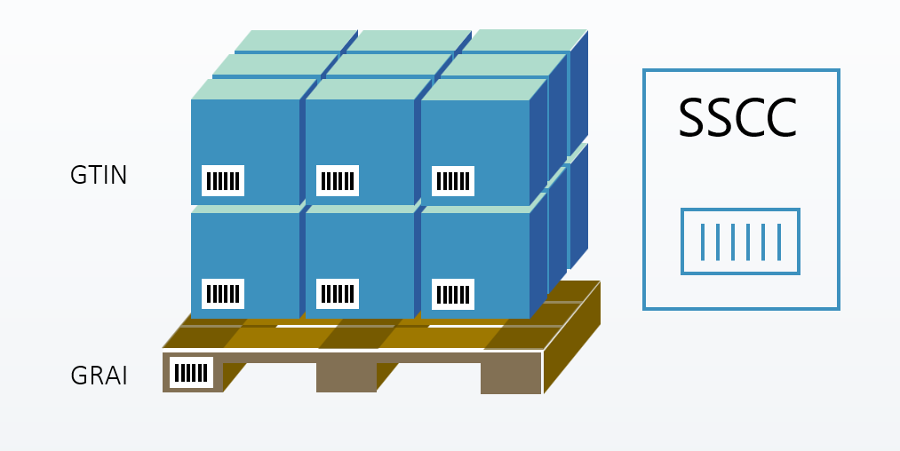

# Logistic Unit

Logistic Unit is an item that is used for transportation or storage and needs to be managed through the supply chain. It could be a box or a pallet containing a few products, or an intermodal container with several pallets. The logistic unit includes information such as SSCC numbers, serial numbers, and total quantity of items that can be added to sales, purchase and warehouse documents.

Logistic Unit is identified by a combination of:

- a carrier, such as a pallet, which is uniquely identified worldwide by means of a Global Returnable Asset Identifier (GRAI).
- and products/items uniquely identified worldwide using Global Trade Item Numbers (GTIN’s).

SSCC - Serial Shipping Container Code can be used by companies to identify a logistic unit, which can be any set of trade items packed together for storage and/or transportation purposes; for example, a case, pallet or parcel.

Logistic Unit Type is a master data entity that defines standardized container specifications for logistics operations. It serves as a template for creating actual logistic units (containers, pallets, trailers, etc.) by specifying their physical dimensions (internal/external length, width, height), weight capacities (tare, payload, maximum), volume limits, and operational constraints. The entity includes control settings for enforcing volume, weight, and footage limits during loading, temperature control capabilities, loading type preferences, and mixing rules for source documents and locations. It also manages numbering series for unit creation and SSCC (Serial Shipping Container Code) assignment, making it a comprehensive blueprint for logistics container management that ensures consistent handling and compliance across warehouse operations [See detailed](logisticunittyp.md).

