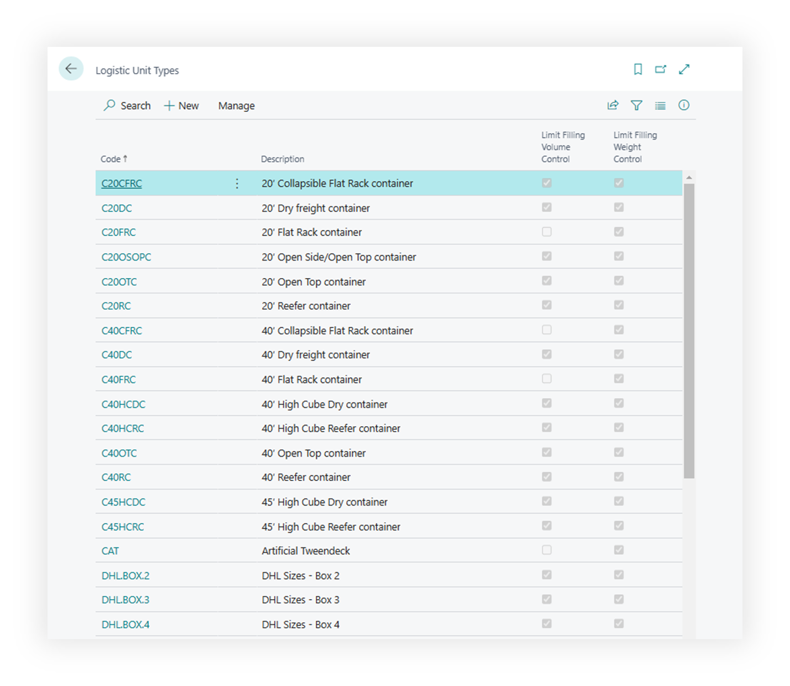

# Logistic Unit Type

Logistic Unit Type is a class a Logistic Unit belongs to. For example, it might be box, pallet, container, truck or any other abstract kind of logistic unit one could imagine.
Logistic Unit Type is an attribute/template of a Logistic Unit that must be determined when Logistic Unit is being created.

## Fields Description

### General

- **Code** Unique identifier of the type.
- **Description** of the logistic unit type.
- **Sorting Order** – The value in this field defines the sorting order for type selection pages. Frequently used types can be placed at the beginning of the list, thus ignoring sorting by the Code field.
- **No. Series** – Number series that will be used to create a new logistic unit of this type.
- **Reusable** – specifies the default settings that new logistic unit will have Reusable parameter. Term Reusable defines a physically existing logistic unit, like a fixed asset. During the operating with a logistic unit, the system will transfer all lines, records, and references to the archive, and the logistic unit will not be deleted.
- **Automatic SSCC Creation** - allows you to create a new SSCC label automatically after creating new logistics units and assigning them an SSCC.
- **SSCC No. Series** Specifies the number series used to assign SSCC numbers for new logistic units.

### Control

Weight:

- **Limit Filling Weight** Specifies the recommended maximum weight for contents in this unit type, if enforced.
- **Strict Weight Control** Specifies if the unit strictly forbids weights above the Limit Filling Weight setting.

Volume:

- **Limit Filling Volume** Specifies the maximum volume that should not be exceeded when adding items to this unit.
- **Strict Volume Control** Specifies if the unit strictly forbids volumes above the Limit Filling Volume value.

Footage:

- **Footage** Specifies the maximum floor area or footprint the unit can occupy or enforce.
- **Strict Footage Control** Specifies if the unit strictly forbids footage (floor space) above the max Footage value.

Content

- **Mix Source Document Allowed** Specifies if items from multiple source documents can be combined within one unit.
- **Mix Location/Bin Allowed** Specifies if items from different warehouse locations or bins can coexist in this unit.

Transport Conditions Attribute

- **Item Attribute Value Name** An item attribute related to the transportation conditions. You can create an item attribute to assign to products that require special transportation conditions (frozen, chilled, etc.), as well as to Logistic Unit types that support such transportation conditions, for example, a refrigerated truck.

### Weight

- **Weight Unit of Measure** Specifies how to measure weight, including tare and payload, for units of this type.
- **Tare Weight** Specifies the empty weight of the logistic unit when no items are loaded.
- **Payload Weight** Specifies how much cargo weight the unit can hold without exceeding structural limits.
- **Max Weight** Specifies the total loaded weight limit, including tare weight, to avoid overloading.

### Sizes

- **Linear Unit of Measure** Specifies how to measure length, width, and height for logistic units of this type.
- **Volume Unit of Measure** Specifies how to measure volumes (internal or external) for units of this type.

Internal sizes

- **Internal Length** Specifies the internal length of the unit''s usable space for placing goods.
- **Internal Width** Specifies the internal width of the unit''s usable area, ensuring items fit properly.
- **Internal Height** Specifies the internal height available for items within the unit (from base to top).
- **Internal Volume** Specifies the total inner volume of the logistic unit, used to calculate fill capacity.

External sizes

- **Length** Specifies the unit''s external length dimension, used in volume and space calculations.
- **Width** Specifies the external width of the logistic unit for dimension-based calculations.
- **Height** Specifies the external height of the logistic unit, from its base to the top edge.
- **Unit Volume** Specifies the external volume of this unit, from length × width × height measurements.
